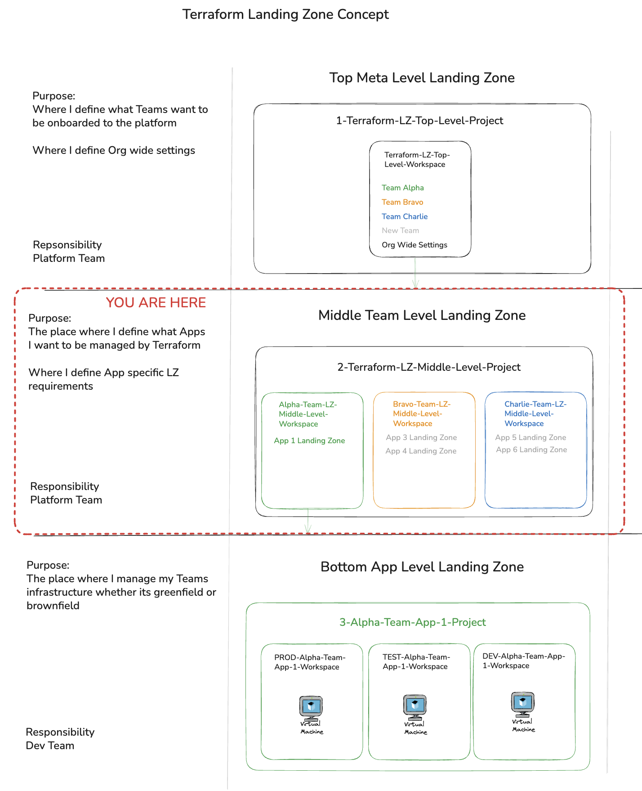

This repo has been provisioned by following the instructions [listed here](https://github.com/monoganog/Terraform-LZ-Top-Level-Repo/blob/main/README.md)

You should now have a number of workspaces that are backed up by repos such as this one. Now it is time to define which Applications/Projects this team wants to manage with Terraform

# Usage

1. First make sure that [this module](https://github.com/monoganog/terraform-tfe-lz-bottom-level-module) is added to your private module registry by [following these steps](https://developer.hashicorp.com/terraform/cloud-docs/registry/publish-modules).
2. Once the module has been added to your registry, then replace line 29 "  source  = "app.terraform.io/ben-monaghan-org/Terraform-LZ-Bottom-Level-Module/tfe"" with the URL for the module that now lives in your registry.
3. Uncomment the code to make use of this module and run the workspace

You should now have provisioned the bottom layer of the Terraform Landing zone concept. You should now have a Project named after your app with 3 Workspaces that represent the different environments, all backed by a git repo. To continue the tutorial navigate to the newly made repo. 

